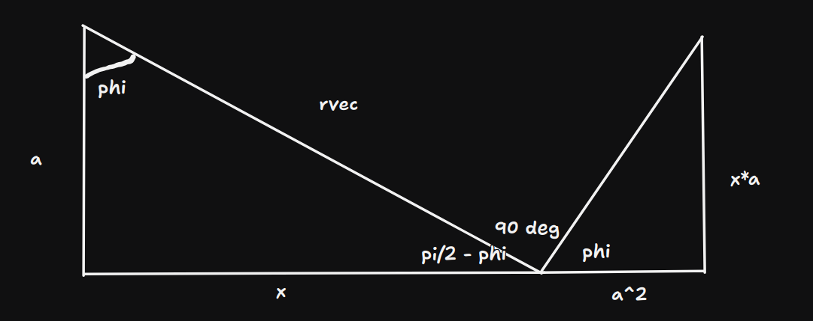

# http://nebula2.deanza.edu/~newton/4B/4BE2004.jpg
## todo switch the current direction 

First recall how to find the E field along the axis of the charged ring

Ring (charge q, radius a) on yz plane centered at origin and test point P at [x, 0, 0]

rvec is the vector P - dq = [x, 0, 0] - [0, a cos theta, a sin theta]
    = [x, -a cos theta, -a sin theta]
r is the normed distance from dq to the test point 
r = sqrt(x2 + a2)

dq / ds = q / (2 pi a) = lam

ds/dphi = arclen / angle = a 
ds = a dphi

dq = lam a dtheta

E = int dE (POS) = int k dq rhat / r2 
    = int dEx + int dE_perp     | by symmetry the integral of the perpendicular component is zero
    = int dEx 
    = int k dq cos theta ihat / r2  | theta is the angle that (origin, test point, dq) makes 
    = int k dq x ihat / r3 
    = k lam a ihat int x dphi / r3 
    = k lam a ihat int x dphi / (x2 + a2)^(3/2)
    = k lam a ihat x / (x2 + a2)^(3/2) int (0, 2pi) dphi
    = 2pi k lam a ihat x / (x2 + a2)^(3/2)
    = ihat 2 pi k q a x / (2 pi a (x2 + a2)^(3/2))
    = ihat k q x / (x2 + a2)^(3/2)

Now instead of a charged ring we imagine that the ring has a current I going clockwise when looking FROM the -ihat direction 
and we want to find the B field at the same P (no net charge on the ring i think, just current so E is zero)

The way to find B fields in this case is with Biot Savart 

B = int dB (POS)
k = mu/4pi
dB = k * (I dl cross rhat) / r2 

the path traced by the ring is l(phi) = (0, a cos, a sin)
dl/dphi = (0, -a sin, a cos)
so for phi= 0
dl = (0,0,a) dphi 

rvec = P - l(phi)
= [x, -a cos, - a sin]
r = sqrt(x2 + a2)
rvec @ phi = 0 : (x, -a, 0)

for phi = 0: eval Idl cross rvec
det [
    i           j               k
    0           0               I a dphi
    x          -a               0
]
ihat * I a2 dphi
-jhat * - x I a dphi
= I dphi [a2, x a, 0]

we can see from the phi=0 point (0, a, 0) the B field (dB field) points in ihat and jhat (so on the xy plane)

we are trying to see that the dBx component (the part that survives) is dB * cos phi 

Firstly we can notice from dl/dphi = [0, -asin, acos]
and rvec = [x, -acos, -asin]
take dl dot rvec  = 0 + a2 sin cos - a2 sin cos = 0 

thus the general form shows rvec always perpendicular to dl 
sin90 = 1
so we can rewrite norm(dl)* norm(rhat) * sin90      | see that this 90 is NOT PHI its the angle made by dl and rvec 
    = norm(dl)*rhat

norm(dl) = a dphi

and dB = 
    = k * I (dl cross rvec) / r3
    = k I |dl| rhat sin90 nhat / r3     | nhat is the vector perpendicular to both dl and rhat 
    = nhat k I a * sqrt(x2 + a2) dphi / (x2 + a2)^(3/2)

the main flow i think i want to show is 
B = int dB (pos)
    = int dBx + int dB_perp     | sym => int dB_perp = 0
    = int dBx
    = int dB * cos phi ihat
    = ihat int k I a r dphi * (a/r) / (r^3)
    = ihat int k I a2 dphi / r3 
    = ihat k I a2 / r3 int (0, 2pi) dphi
    = ihat 2pi k I a2 / (x2 + a2)^(3/2)
    = ihat mu0 I a2 / (2 (x2 + a2)^(3/2))

note that in the E field: E = 0 when x = 0 
but for the B field, B is maximized at x = 0 

