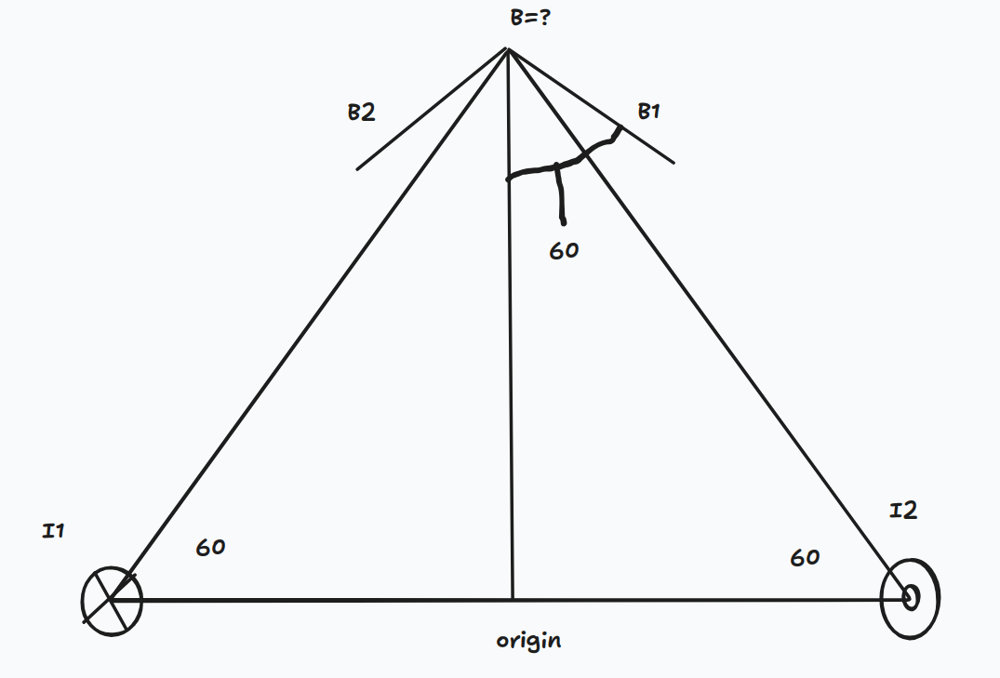

2. Two currents, I1 into the paper and I2 out of the paper (where
their magnitudes are the same) are arranged being on two
vertices of an equilateral triangle of length L. Find the magnetic
field vector from those two currents at the third vertex of that
equilateral triangle

# soln
# todo try to solve with Biot savart? 
Draw an equalateral triangle with the base horizontal
call the base midpoint origin

infinite wire has current into page (-khat) on the left point (arbitrarily) and out of page on right point

|I1| = |I2|
the prob is find B at the third triangle vertex 

This problem is an application of amperes law:

quickly find that 2 pi r B = mu I
B = mu I / (2 pi r)

and we found the direction of B with 3 step RHR dl x r 
and its perpendicular to rvec in xy plane pointing right

it can easily be seen that the angle this vector makes to the vertical is 60 deg

and by symmetry the other current creates B2 

see that B1y = B1 cos60 * -jhat         | jhat found by inspection
    = -jhat mu I cos 60 / (2 pi L)
B = B1 + B2 (POS)
    = B1x + B1y + B2x + B2y     | by symmetry xs cancel
    = B1y + B2y
    = -jhat mu I cos 60 / (2 pi L) + -jhat mu I cos 60 / (2 pi L)
    = -jhat mu I cos 60 / (pi L)

# biot savart attempt 
first start with I1 

l1(z) = (-L/2, 0, -z)        | note the -z i think we need it since the current is going into the page (-khat)
dl1/dz = (0, 0, -1)
dl = -dz khat
P = [0, L, 0]
r1vec = [L/2, L, z]
r1 = sqrt((L/2)2 + L2 + z2)
    = sqrt(5/4L2 + z2)

l2(z) = (L/2, 0, z)
dl2/dz = (0,0,1)
dl2 = dz khat
dl1 cross r1vec = |
    i               j               k
    0               0               -dz
    L/2             L               z   |
dl1 cross r1vec = L dz [-1, 1/2, 0]
ihat L dz - jhat L/2 dz

r2vec = [0, L, 0] - [L/2, 0, z]
    = [-L/2, L, -z]

    
dl2 cross r2vec = |
    i               j               k
    0               0               dz
    -L/2             L               -z   |

dl2 cross r2vec = L dz [-1, 1/2, 0]
-ihat L dz - jhat L/2 dz 

r1 = r2
dB = k (Idl cross rvec) / r3
B = int dB1 + int dB2 (POS)
    = k L dz [-1, 1/2, 0] / (5/4L2 + z2)^(3/2)
...

B = - I mu L / 4pi * int (-inf, inf) dz / (r3)
B = - I mu L / 4pi * int (-inf, inf) dz / (5/4 L2 + z2)^(3/2)

the point P is wrong here. P should be at (0, sqrt(3)/2 L, 0)
this makes r simplify to sqrt(L2 + z2) which makes way more sense 

the correct unevaluated integral answer is 
B = - I mu L / 4pi * int (-inf, inf) dz / (L2 + z2)^(3/2)
